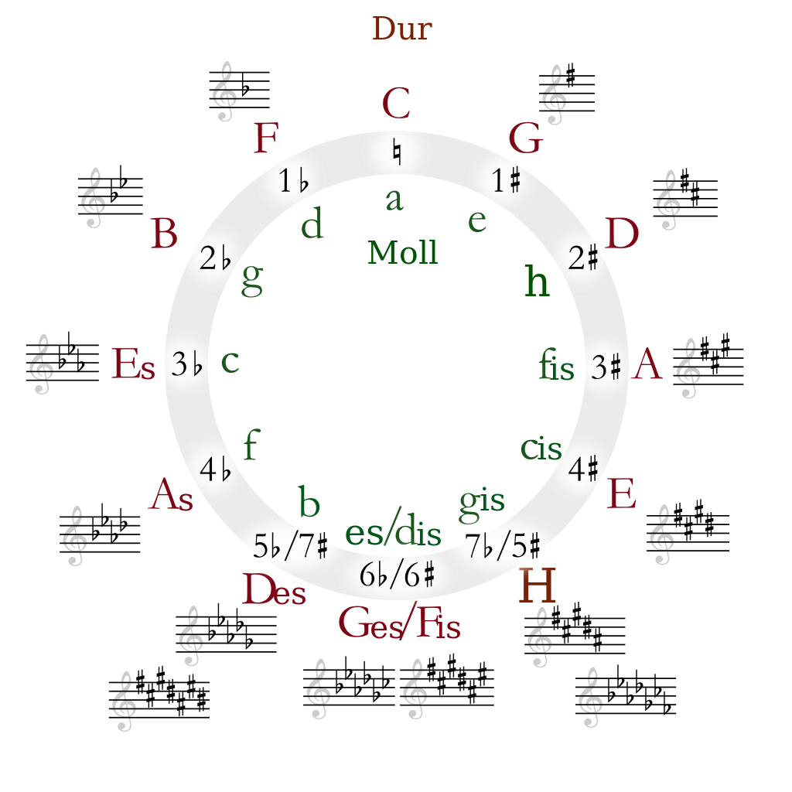

Quintenzirkel
=============

    Jpascher, CC BY-SA 3.0 <https://creativecommons.org/licenses/by-sa/3.0>, via Wikimedia Commons

Merksatz
--------
Dur-Tonarten mit #: Geh du alter Esel hohle Fische
Dur-Tonarten mit b: Feine Bauern essen asiatisches dessert gesaltzen